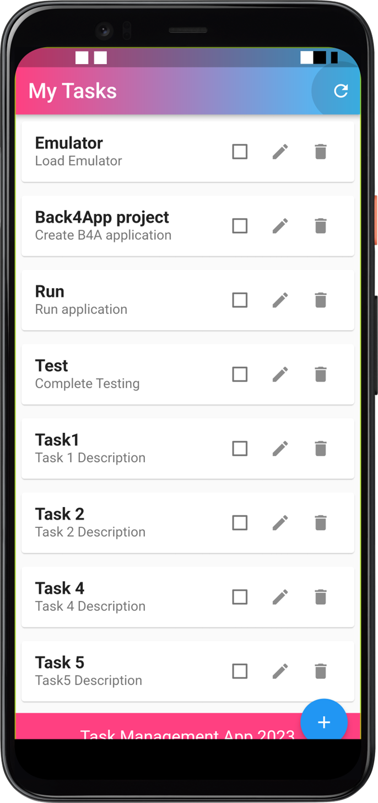
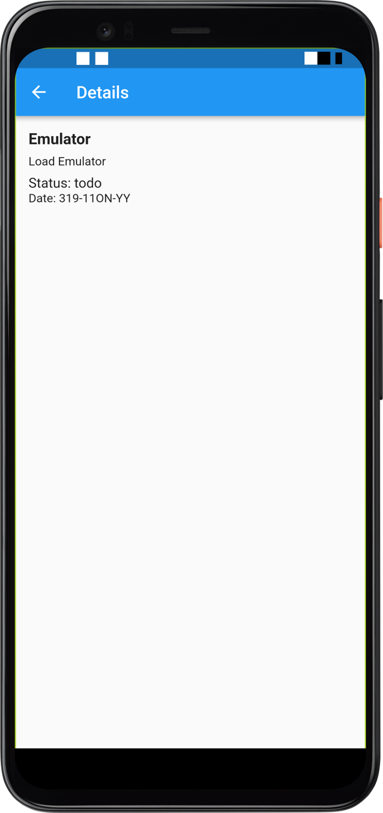
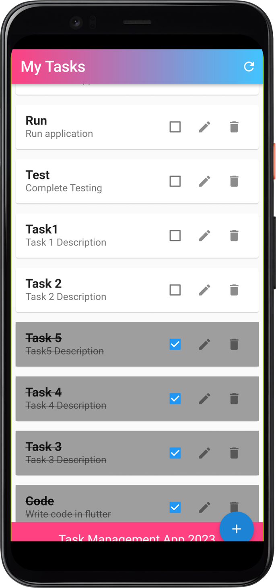
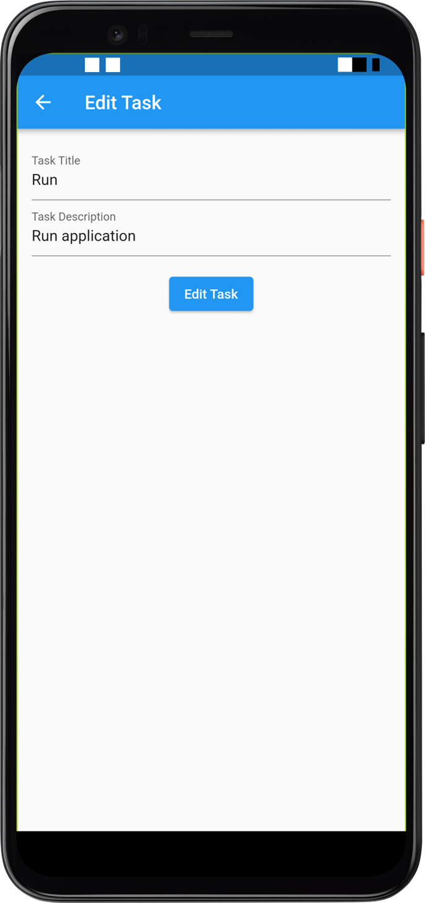
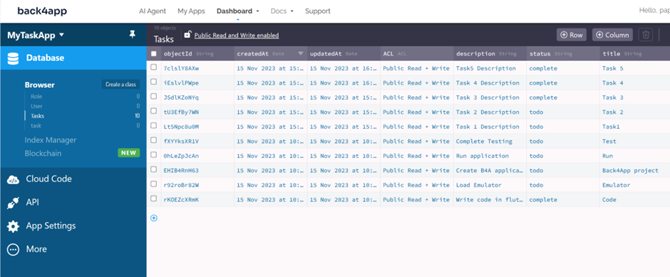

# Task Management Application with Flutter and Back4App 

 # GITHub : 
# Steps
## 1.Sign Up or Sign In on Back4app
## 2.Once signed in click “Build a new app” and give a name to your app
## 3.You will be taken to the console where by default there are 2 classes Under Database present namely Role and User. Create a new class named task which will store the data for each Task item.
## 4. Create 3 columns title, description and status as string.
## 5.Clone this repo
## Navigate to main.dart and provide the application ID, Client Key and parse URL
## From device manager, add an android emulator.
## Run flutter app

# Snapshots
## Task list view 
## Mark as completed 
## Edit Task
## Add Task 
## Back4App Records 

# Roadmap :
## Enable paging/ Scrolling
## Highlight overdue tasks
## Highlight tasks nearing due date
## Option to import tasks from file
## Integrate with email, wearables

## **References:**

- https://www.back4app.com/docs/flutter/parse-sdk/data-objects/flutter-crud

- https://www.liquidweb.com/kb/how-to-install-and-configure-flutter-sdk-windows-10/

- https://pub.dev/packages/parse_server_sdk_flutter/install

